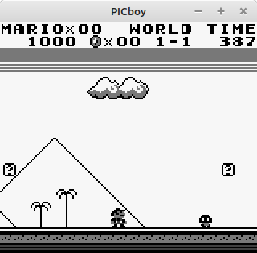

# PICboy
A fast Gameboy (Color) Emulator designed for use in Microcontrollers 

This emulator is completely hand-made without any previous code used, though it was inspired by <a href="https://github.com/deltabeard/Peanut-GB">Peanut-GB</a> and used it for reference occasionally. 

The principle is to keep this emulator in a single C file and have it as portable as possible to smaller devices.  It is also designed for speed over accuracy.  It uses OpenGL/GLFW and OpenAL as a basis for graphics and audio on desktop computers.  It was developed on Linux but should be portable to other systems with minimum or no effort at all. 

As of now, it is a full DMG emulator with audio included, for No-MBC, MBC1, MBC2, MBC3, and MBC5 carts.  Future development will focus on GBC additions. 

<b>Features:</b> 
- Cart RAM Save/Load 
- Turbo A/B Buttons 
- Fast-Forward and Freeze 

<b>Resources:</b> 
- <a href="https://gbdev.io/pandocs/About.html">https://gbdev.io/pandocs/About.html</a>
- <a href="https://gbdev.gg8.se/wiki/articles/Main_Page">https://gbdev.gg8.se/wiki/articles/Main_Page</a>
- <a href="https://gekkio.fi/files/gb-docs/gbctr.pdf">https://gekkio.fi/files/gb-docs/gbctr.pdf</a>
- <a href="https://mgba-emu.github.io/gbdoc/">https://mgba-emu.github.io/gbdoc/</a>

<b>Images:</b> 
<table>
  <tr><td><table><tr><td></td></tr><tr><td align="center"><b>Tetris</b></td></tr></table></td>
    <td><table><tr><td></td></tr><tr><td align="center"><b>Kanto Expansion Pak</b></td></tr></table></td></tr>
  <tr><td><table><tr><td></td></tr><tr><td align="center"><b>F-1 Race</b></td></tr></table></td>
    <td><table><tr><td></td></tr><tr><td align="center"><b>Super Mario Land</b></td></tr></table></td></tr>
  <tr><td><table><tr><td></td></tr><tr><td align="center"><b>Link's Awakening DX</b></td></tr></table></td>
    <td><table><tr><td></td></tr><tr><td align="center"><b>Tobu Tobu Girl DX</b></td></tr></table></td></tr>
</table>
