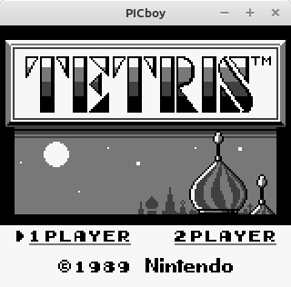
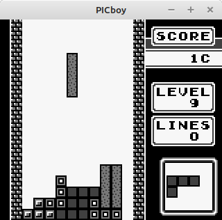
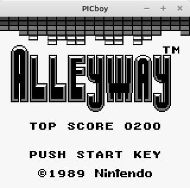
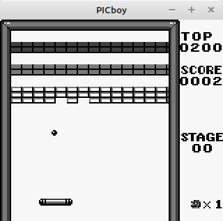
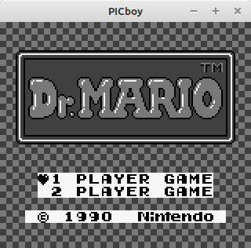
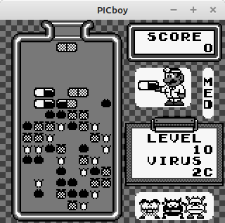

# PICboy
A Gameboy (Color) Emulator designed for use in Microcontrollers 

<b>Work In Progress</b> 

<b>Images:</b> 
<table>
  <tr><td></td><td></td></tr>
  <tr><td></td><td></td></tr>
  <tr><td></td><td></td></tr>
</table>
